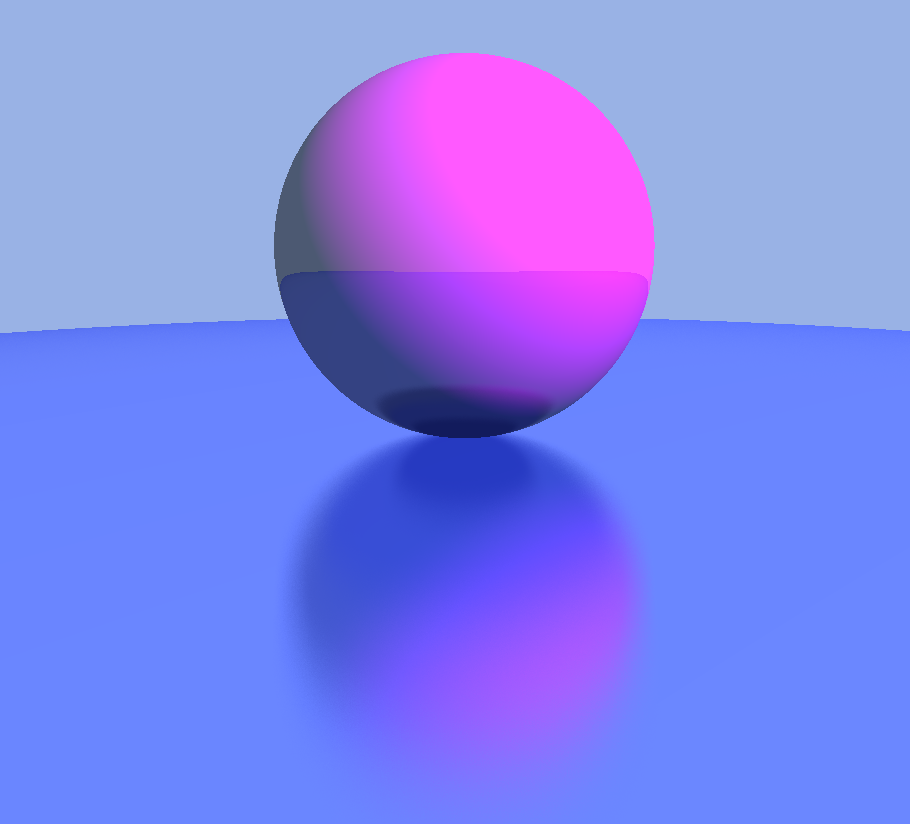

# Raytracing

This is a basic raytracing engine, which is a part of The Cherno's Raytracing series on YouTube. It is meant to teach how raytracing works, what raytracing pipeline looks like and how to optimize it to make it run in real time.

### Example render

	

